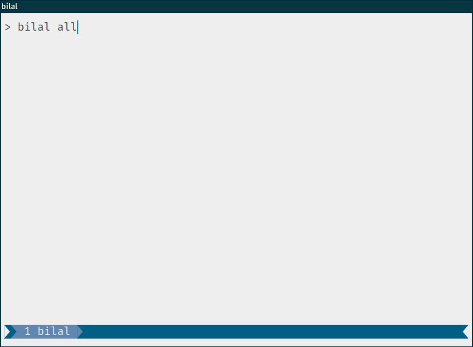
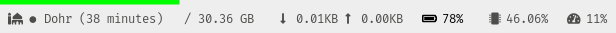
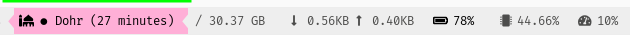

<div align="center">
<h1>Bilal</h1>

<a href="https://builds.sr.ht/~azzamsa/bilal?">

</a>
<a href="https://crates.io/crates/bilal">

</a>
<a href=" https://docs.rs/bilal/">

</a>
<a href="https://azzamsa.com/support/">
</a>
<p></p>



</div>

---

**bilal** is a CLI salah time.

## Features

- Show all salah time in current day
- Show current salah time and its remaining time
- Show next salah time

## Usage

## Usage Examples

``` bash
bilal all                            Show all salahs time
bilal current                        ... current salah time
bilal current --json                  .... with JSON format
```

Create a file named `bilal.toml` in `~/.config/bilal/`. If you are on `Windows`, put it under `\AppData\Bilal\`. Then add your configuration:

``` toml
timezone = 7
latitude = -6.18233995
longitude = 106.84287154
madhab = "Shafi"
method = "Egyptian"
```

To see more options, please read the [wiki](docs/wiki.md)

### Command-line options

``` bash
USAGE:
    bilal [FLAGS] [OPTIONS] [salah]

ARGS:
    <salah>    A Salah to show [default: all]

FLAGS:
    -h, --help       Prints help information
    -J, --json       Display Salah in JSON formatted string
    -V, --version    Prints version information

OPTIONS:
        --color <WHEN>    Display Salah in colored output [default: always]
```

### Usage with other tools

You can use Bilal with `i3status-rust` to show salah time in your status.





`i3status-rurts` configuration Example:

``` bash
[[block]]
block = "custom"
cycle = [
        "bilal current -J",
        "bilal next -J",
        ]
on_click = "<command>"
interval = 300
json = true

```

See [more examples](examples/) to learn other variations.

If you like `bilal` to support your favourite status-bar, please hit me in
the [mailing-list][mailing-list] with the valid input of your status-bar. In i3status-rust
the valid input it would be `{"icon": "ICON", "state": "STATE", "text": "YOURTEXT"}`.

## Installation

### From binaries

The [release page](https://git.sr.ht/~azzamsa/bilal.rs/refs/) includes
pre-compiled binaries for GNU/Linux, macOS and Windows.

### From source

Using Rust's package manager [cargo](https://github.com/rust-lang/cargo):

``` bash
cargo install bilal
```


## Development

``` bash
git clone https://git.sr.ht/~azzamsa/bilal.rs
cd bilal.rs

# Run unit tests and integration tests
cargo test

# Install
cargo install --path .
```

## Contributing

For reporting issues, visit the tracker here: https://todo.sr.ht/~azzamsa/Bilal

Please send patches to `~azzamsa/public-inbox@lists.sr.ht`

To learn more read [contributing.md](docs/dev/contributing.md)

## Origin of the name

The name Bilal was chosen in reference to the Bilal bin Rabah. The first
mu'azzin, chosen by Muhammad PBUH himself.

## License

Copyright (c) 2020 Azzamsa

Bilal is distributed under the terms of [GPL V3 License](LICENSE).


